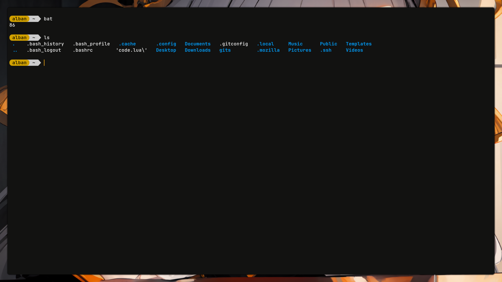
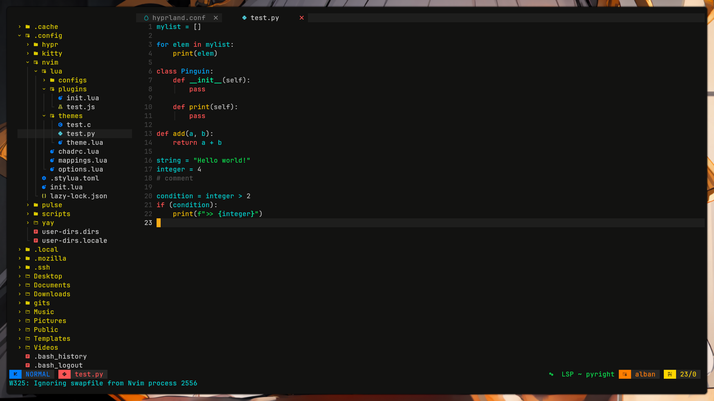
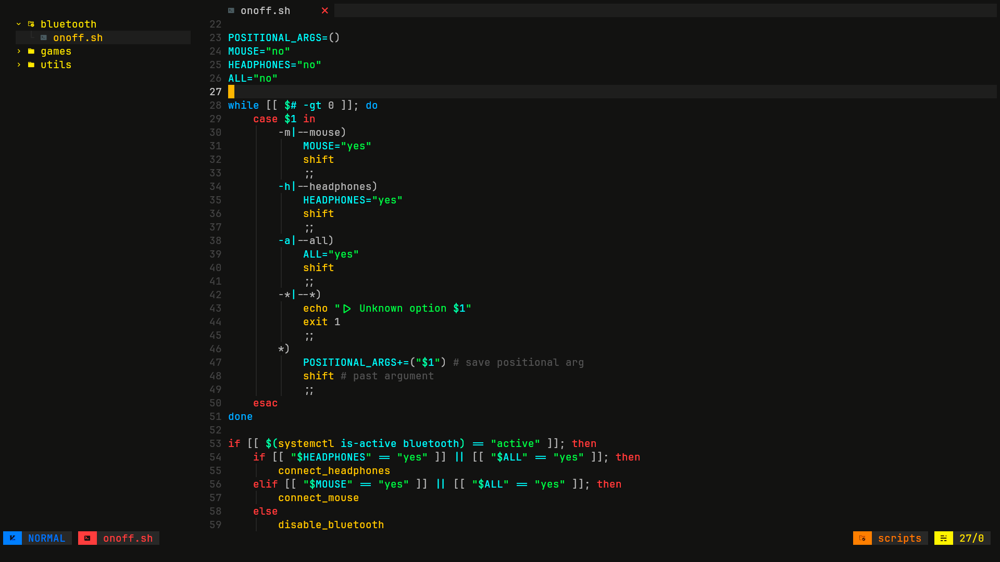

# My dotfiles

## Installation
1. Clone this repo in some directory.
```
cd <some_directory>
git clone git@github.com:faurealban/dotfiles
```

2. Execute the installation script
```
chmod +x ./install.sh
./install.sh -b
```

> [!WARNING]
> Using script with the option `-b` or `--backup` is recommended.
> It creates a backup of your actual config, just in case.

## Programs

- fcitx5
- greetd
- grim
- hypridle
- hyprland
- hyprlock
- hyprpaper
- hyprshade
- kitty
- obsidian
- tuigreet

## Preview






