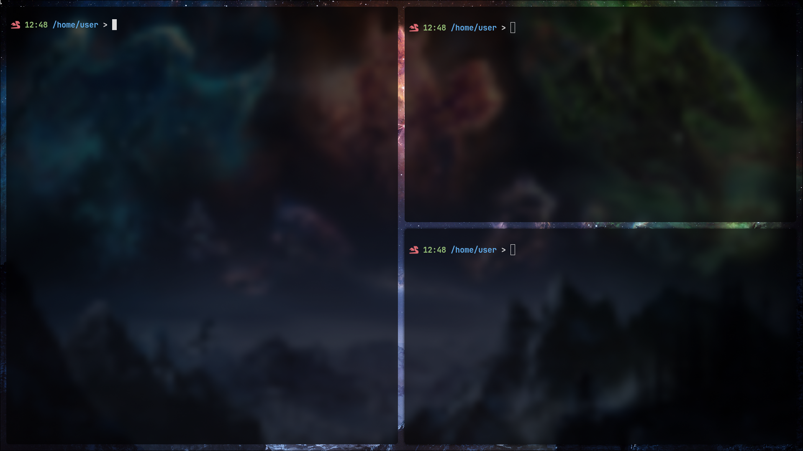
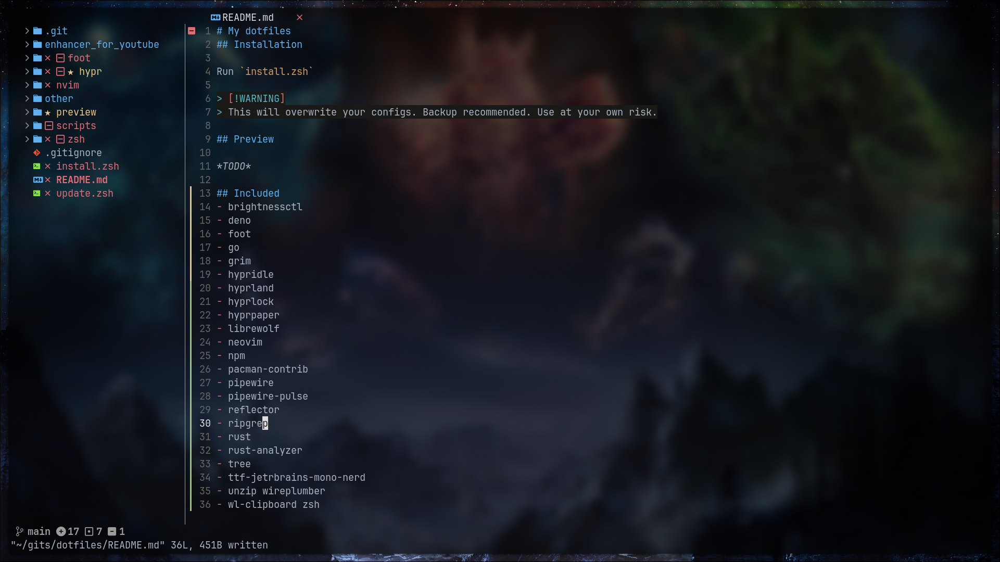

# My dotfiles
## Preview



## Installation
If you only want some specific configuration, search in this repo.\
If you want everything: run `install.zsh`

> [!WARNING]
> This will overwrite your configs. Backup recommended. Use at your own risk.

After istallation, do:
```
nvim
:Lazy sync
:MasonInstallAll
```

## Included
- brightnessctl
- deno
- docker
- docker-compose
- dolphin
- droidcam
- foot
- go
- grim
- hypridle
- hyprland
- hyprlock
- hyprpaper
- librewolf
- neovim
- noto-fonts-cjk
- npm
- openssh
- pacman-contrib
- pipewire
- pipewire-pulse
- reflector
- ripgrep
- rust
- rust-analyzer
- tree
- ttf-jetbrains-mono-nerd
- unzip
- vesktop-bin
- virtualbox
- virtualbox-host-modules-arch
- wireplumber
- wl-clipboard
- xdg-desktop-portal-hyprland
- zsh
